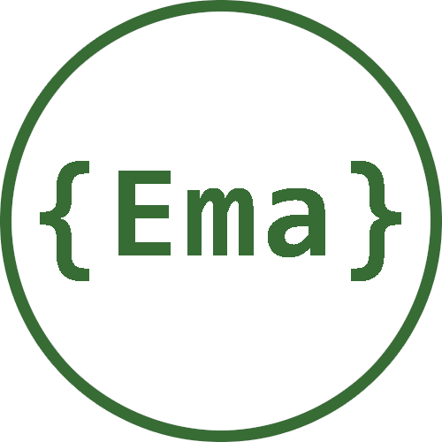

<h1> Hola, mi nombre es Emanuel Eroles</h1>

Desarrollo de Software y Programación

Desde pequeño me ha interesado la informática y a partir del 2014 comencé a experimentar con la programación. Hoy, y gracias a la Tecnicatura en Programación, siento que ya tengo capacidades para aportar valor a un equipo de trabajo. Mi curiosidad, hace que me interese todo el ciclo de vida del software, pero quiero especializarme en el desarrollo backend.

